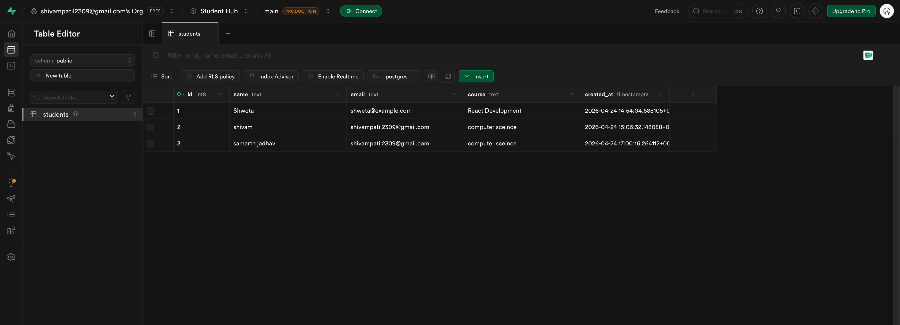
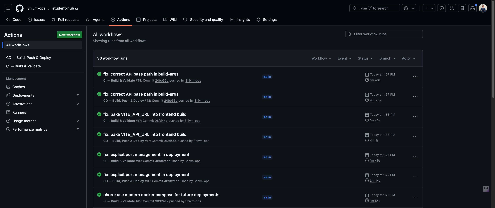

# 🔐 Secure Secret Management & Deployment

A showcase of enterprise-grade security for handling passwords, API keys, and environment variables.

## 🚀 The Goal
To prove that a full-stack cloud application can be deployed with **Zero Leaks**. No secrets ever enter the source code or version control history.

---

## 📸 Step-by-Step Implementation

1. **GitHub Secrets**: Used for secure CI/CD automation (SSH keys, Docker tokens).
   

2. **Supabase Integration**: Remote database access via protected environment variables.
   

3. **Automated Pipeline**: GitHub Actions securely building and deploying images.
   

4. **Server Isolation**: Production `.env` files live only on the AWS server, never in Git.
   

5. **Container Security**: Mapping secrets into isolated Docker containers at runtime.
   

---

## 🛡️ Security Strategy
* **.gitignore**: The first line of defense—blocking `.env` and sensitive files from being pushed.
* **Build-Args**: Injecting public routing (IPs) only during the build stage.
* **Runtime Secrets**: Sensitive passwords (DB, JWT) stay strictly on the production server.

---
**Author:** Shivam Patil | *DevOps & Full Stack Developer*

---
*Last Updated: April 25, 2026*
